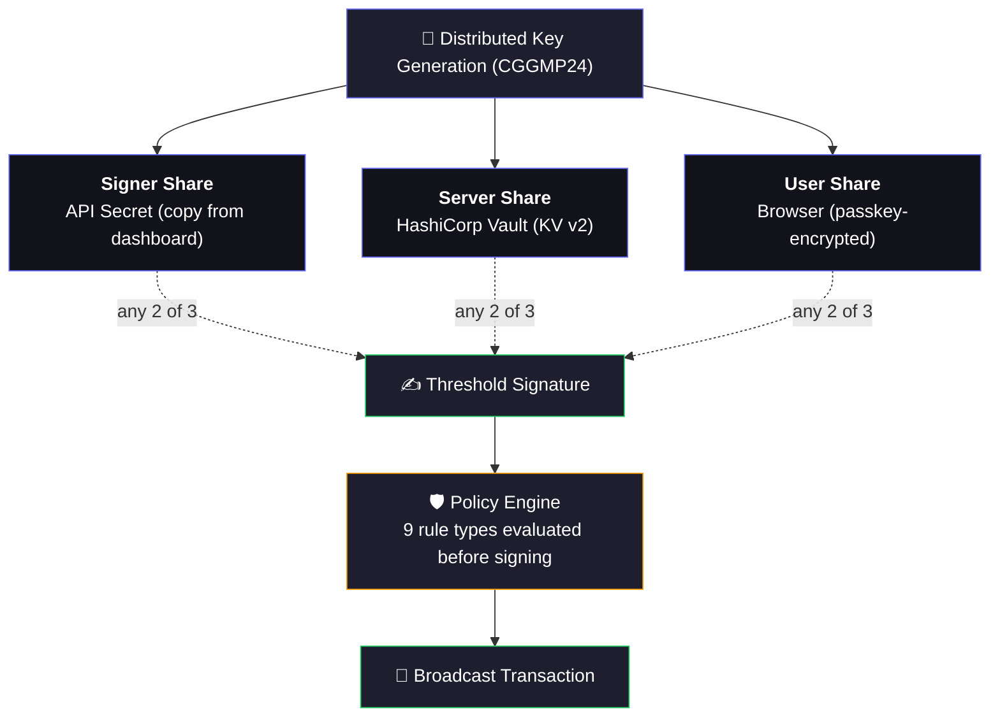

<div align="center">

# Guardian Wallet

### The wallet where the key never exists.

Self-hosted. Open-source. 2-of-3 threshold ECDSA.

The full private key is never constructed — not during creation, not during signing, not ever.

[](https://github.com/agentokratia/guardian-wallet)
&nbsp;
[](LICENSE-APACHE)
[](LICENSE)
[](https://eprint.iacr.org/2021/060)

[Quick Start](#quick-start) · [Why Guardian](#why-guardian) · [Docs](#how-it-works) · [Website](https://agentokratia.com)

</div>

---

## Quick Start

```bash
git clone https://github.com/agentokratia/guardian-wallet.git && cd guardian-wallet
docker compose up -d          # Starts server, database, vault
guardian-wallet init           # Interactive setup — generates keys, configures policies
guardian-wallet send 0xRecipient 0.1   # Send ETH. Threshold-signed. Policy-checked. Audited.
```

It's free. It's open-source. Clone the repo. Run it.

> **Development setup?** See the [full install guide](#install-and-run) for building from source with pnpm.

---

## Why Guardian

Your AI agent needs a wallet. Here's what's out there:

| | **Raw private key** | **Fireblocks** | **Guardian Wallet** |
|---|---|---|---|
| **Security** | One leaked `.env` = everything gone | MPC, but they hold the shares | 2-of-3 threshold — you hold all shares |
| **Policy engine** | None | External rules only | 9 built-in policy types |
| **Audit log** | None | Dashboard | Full log + CSV export |
| **Self-hosted** | N/A | No — cloud SaaS | Yes — your infra, your data |
| **Setup** | 1 line of code, 0 safety | Weeks (enterprise sales) | 10 minutes (Docker) |
| **Cost** | Free (and you get what you pay for) | $50k–$500k/yr | Free and open-source |
| **Open source** | N/A | No | Yes (AGPL + Apache 2.0) |
| **Agent-native** | Copy-paste a key into `.env` | API, not built for agents | CLI + SDK + MCP server |

Guardian splits every private key into 3 shares. Any 2 can co-sign a transaction. The full key is never reconstructed — not in memory, not in logs, not anywhere. Agents get spending power. Operators keep control.

---

## The Problem

AI agents need on-chain spending power, but every existing approach forces a tradeoff between autonomy and security.

| Approach | Risk | Limitation |
|----------|------|------------|
| Hot wallet | Single key compromise = total loss | No policy enforcement at signing layer |
| Smart contract wallet | On-chain gas overhead, chain-specific | Requires deployed contracts per chain |
| TEE / enclave | Hardware supply chain trust, attestation complexity | Vendor lock-in, limited auditability |
| Standard MPC (2-of-2) | Both parties must be online, no recovery path | Single point of failure if one party is lost |
| **Guardian (2-of-3 threshold)** | **No single point of compromise** | **Self-hosted, open source, chain-agnostic** |

Guardian eliminates the tradeoff. The private key is split into 3 shares via distributed key generation. Any 2 shares can co-sign a transaction through a distributed computation. No share alone is useful. No party ever holds the full key.

---

## How It Works

### Core Invariant

```
THE FULL PRIVATE KEY MUST NEVER EXIST.
Not in memory, not in logs, not in any variable, not in any code path.
Every signing operation is a distributed computation between two share holders.
```

### Key Generation

The CGGMP24 distributed key generation protocol produces 3 shares from randomness. The full private key is never constructed -- each party generates their share independently, and the protocol derives the public key (Ethereum address) from the shares without combining them.

### Three Signing Paths

Any 2 of the 3 shares can co-sign a transaction:

| Path | Shares | Use Case |
|------|--------|----------|
| Signer + Server | Agent share + Server share | Normal autonomous operation |
| User + Server | PRF-encrypted share + Server share (browser WASM) | Dashboard manual signing |
| Signer + User | Agent share + User share | Server down or bypass |

### Architecture



---

## Install and Run

### Prerequisites

- Node.js 20+
- pnpm 9+
- Docker (for Supabase local dev)
- Rust and wasm-pack (for building the WASM MPC library)

### From Source

```bash
git clone https://github.com/agentokratia/guardian-wallet.git
cd guardian-wallet

# Copy the dev env — it works out of the box, no edits needed
cp .env.example .env

pnpm install
pnpm build

# Start Supabase (runs migrations automatically)
npx supabase start

# In separate terminals:
pnpm --filter @agentokratia/guardian-server dev   # Server on :8080
pnpm --filter @agentokratia/guardian-app dev      # Dashboard on :3000
```

Open `http://localhost:3000` to access the dashboard.

> **Production?** See [`.env.production.example`](.env.production.example) for Vault KMS, Resend email, and real domain configuration.

### Create Your First Signer

**Via Dashboard:** Open `http://localhost:3000`, sign in, and follow the Create Signer wizard. The wizard walks through naming, chain selection, DKG, policy configuration, and credential download.

**Via CLI:**

```bash
# Interactive setup -- configures server URL, API key, network
guardian-wallet init

# Check connection and signer status
guardian-wallet status

# View balance
guardian-wallet balance
```

---

## CLI Reference

The `guardian-wallet` command-line tool provides full signer operations from the terminal (also available as `gw` alias).

| Command | Description | Usage |
|---------|-------------|-------|
| `guardian-wallet init` | Interactive setup wizard | `guardian-wallet init` |
| `guardian-wallet status` | Display signer info and connection status | `guardian-wallet status` |
| `guardian-wallet balance` | Show ETH balance for the configured signer | `guardian-wallet balance [-n network]` |
| `guardian-wallet send` | Send ETH to an address | `guardian-wallet send <to> <amount> [-n network] [--gas-limit N] [--data 0x...]` |
| `guardian-wallet sign-message` | Sign a message using threshold ECDSA | `guardian-wallet sign-message <message>` |
| `guardian-wallet deploy` | Deploy a smart contract | `guardian-wallet deploy <bytecode> [-n network] [--constructor-args 0x...]` |
| `guardian-wallet proxy` | Start a JSON-RPC signing proxy for Foundry/Hardhat | `guardian-wallet proxy [-p port] [-r rpc-url]` |

### Examples

```bash
# Send 0.01 ETH on Base Sepolia
guardian-wallet send 0xRecipient 0.01 --network base-sepolia

# Sign an arbitrary message
guardian-wallet sign-message "Hello from Guardian"

# Sign a hex message (0x prefix)
guardian-wallet sign-message 0xdeadbeef

# Deploy a contract with constructor arguments
guardian-wallet deploy ./MyContract.bin --constructor-args 0x000000000000000000000000...

# Start Foundry-compatible signing proxy on port 8545
guardian-wallet proxy --port 8545

# Use with Forge
# GUARDIAN_RPC=http://localhost:8545 forge script Deploy.s.sol --rpc-url $GUARDIAN_RPC --broadcast
```

---

## SDK and Integrations

### viem (drop-in WalletClient)

```typescript
import { ThresholdSigner } from '@agentokratia/guardian-signer';
import { createWalletClient, http, parseEther } from 'viem';
import { baseSepolia } from 'viem/chains';

const signer = await ThresholdSigner.fromSecret({
  apiSecret: process.env.GUARDIAN_API_SECRET!,
  serverUrl: process.env.GUARDIAN_SERVER!,
  apiKey: process.env.GUARDIAN_API_KEY!,
});

const client = createWalletClient({
  account: signer.toViemAccount(),
  chain: baseSepolia,
  transport: http(),
});

const hash = await client.sendTransaction({
  to: '0xRecipient...',
  value: parseEther('0.01'),
});
```

### Vercel AI SDK

```typescript
import { tool } from 'ai';
import { ThresholdSigner } from '@agentokratia/guardian-signer';
import { z } from 'zod';

const sendETH = tool({
  description: 'Send ETH to an address using threshold signing',
  parameters: z.object({
    to: z.string().describe('Recipient address'),
    amount: z.string().describe('Amount in ETH'),
  }),
  execute: async ({ to, amount }) => {
    const signer = await ThresholdSigner.fromSecret({
      apiSecret: process.env.GUARDIAN_API_SECRET!,
      serverUrl: process.env.GUARDIAN_SERVER!,
      apiKey: process.env.GUARDIAN_API_KEY!,
    });
    const hash = await signer.signTx({ to, value: parseEther(amount) });
    signer.destroy();
    return { txHash: hash };
  },
});
```

### LangChain

```typescript
import { DynamicStructuredTool } from '@langchain/core/tools';
import { ThresholdSigner } from '@agentokratia/guardian-signer';
import { z } from 'zod';

const guardianSignTool = new DynamicStructuredTool({
  name: 'guardian_send_eth',
  description: 'Send ETH using Guardian threshold signing',
  schema: z.object({
    to: z.string(),
    amount: z.string(),
  }),
  func: async ({ to, amount }) => {
    const signer = await ThresholdSigner.fromSecret({
      apiSecret: process.env.GUARDIAN_API_SECRET!,
      serverUrl: process.env.GUARDIAN_SERVER!,
      apiKey: process.env.GUARDIAN_API_KEY!,
    });
    const hash = await signer.signTx({ to, value: parseEther(amount) });
    signer.destroy();
    return JSON.stringify({ txHash: hash });
  },
});
```

### Foundry Proxy

The `guardian-wallet proxy` command starts a JSON-RPC server that intercepts `eth_sendTransaction` and `eth_signTransaction`, signs them via the Guardian protocol, and forwards everything else to the upstream RPC.

```bash
# Start the proxy
guardian-wallet proxy --port 8545

# Deploy with Forge
forge script script/Deploy.s.sol \
  --rpc-url http://localhost:8545 \
  --broadcast
```

---

## Dashboard

The Guardian dashboard is a React SPA with 8 pages:

- **Login** -- Email + passkey authentication (WebAuthn). No wallet extension required.
- **Create Signer** -- Wizard: name, chain, DKG ceremony, policy setup, credentials (API Key + API Secret).
- **Signers** -- Grid of signer cards with balances, status indicators, and recent activity.
- **Signer Detail** -- Balance, policies with toggles, signing activity log.
- **Sign** -- Transaction form with simulation preview, browser-side WASM signing (User + Server path).
- **Audit Log** -- Filterable table of all signing requests with CSV export.
- **Settings** -- RPC configuration, Vault connection status, connected wallet.
- **Setup** -- First-run onboarding flow.

Authentication uses email verification + WebAuthn passkeys with PRF-based key derivation. The user share is encrypted client-side using a key derived from the passkey PRF output -- the server stores only opaque ciphertext it cannot decrypt.

---

## Architecture

### Packages

| Package | Description |
|---------|-------------|
| [`@agentokratia/guardian-core`](packages/core) | Shared interfaces and types (zero dependencies) |
| [`@agentokratia/guardian-schemes`](packages/schemes) | CGGMP24 threshold ECDSA via Rust WASM |
| [`@agentokratia/guardian-chains`](packages/chains) | Ethereum chain adapter (viem) |
| [`@agentokratia/guardian-server`](packages/server) | NestJS policy server (port 8080) |
| [`@agentokratia/guardian-signer`](packages/signer) | TypeScript SDK (share loading, signing, viem integration) |
| [`@agentokratia/guardian-wallet`](packages/wallet) | CLI + MCP server (`guardian-wallet` / `gw`) |
| [`@agentokratia/guardian-app`](packages/app) | React dashboard (Vite SPA, port 3000) |

### Dependency Rules

```
core     --> (nothing)
schemes  --> core
chains   --> core
server   --> core, schemes, chains
signer   --> core, schemes
cli      --> signer
app      --> (HTTP API only, no backend imports)
```

### Tech Stack

| Layer | Choice |
|-------|--------|
| Language | TypeScript (strict mode, ESM) |
| MPC | CGGMP24 via Rust WASM (LFDT-Lockness/cggmp21) |
| API | NestJS |
| Dashboard | React + Vite + Tailwind + shadcn/ui |
| Database | Supabase (PostgreSQL) |
| Secret Storage | Pluggable KMS (Vault KV v2 or local-file) |
| Auth | Email + WebAuthn passkeys, JWT sessions |
| Monorepo | Turborepo + pnpm workspaces |
| Linting | Biome |
| Testing | Vitest |

### API Endpoints

All endpoints are prefixed with `/api/v1`.

**Signer-facing (API key auth via `x-api-key` header):**

| Method | Path | Purpose |
|--------|------|---------|
| POST | `/sign/session` | Start Signer+Server signing session |
| POST | `/sign/round` | Exchange CGGMP24 protocol messages |
| POST | `/sign/complete` | Finalize signing, broadcast transaction |
| POST | `/sign-message/session` | Start message signing session |
| POST | `/sign-message/complete` | Finalize message signing |

**Dashboard-facing (JWT session auth):**

| Method | Path | Purpose |
|--------|------|---------|
| POST | `/signers` | Create signer (triggers DKG) |
| GET | `/signers` | List all signers |
| GET/PATCH/DELETE | `/signers/:id` | Signer CRUD |
| POST | `/signers/:id/pause` | Pause signer |
| POST | `/signers/:id/resume` | Resume signer |
| GET | `/signers/:id/balance` | Get signer ETH balance |
| POST | `/signers/:id/simulate` | Simulate transaction (gas estimate) |
| GET/POST | `/signers/:id/policies` | Policy CRUD |
| PATCH/DELETE | `/policies/:id` | Update/delete policy |
| POST/GET | `/signers/:id/user-share` | Store/retrieve encrypted user share |
| POST | `/signers/:id/sign/session` | Start User+Server signing session |
| POST | `/signers/:id/sign/round` | Exchange protocol messages |
| POST | `/signers/:id/sign/complete` | Finalize User+Server signing |
| POST | `/dkg/init` | Start DKG ceremony |
| POST | `/dkg/round` | Process DKG round |
| POST | `/dkg/finalize` | Complete DKG |
| GET | `/audit-log` | Paginated audit log |
| GET | `/audit-log/export` | Export audit log as CSV |
| POST | `/auth/register` | Register with email (sends OTP) |
| POST | `/auth/verify-email` | Verify email OTP |
| POST | `/auth/passkey/register` | Register a WebAuthn passkey |
| POST | `/auth/passkey/login-challenge` | Get passkey login challenge |
| POST | `/auth/passkey/login` | Authenticate with passkey |
| POST | `/auth/logout` | Invalidate session |
| GET | `/auth/me` | Get current authenticated user |

**System:**

| Method | Path | Purpose |
|--------|------|---------|
| GET | `/health` | Health check (503 when degraded) |

---

## Policy Engine

The server evaluates all enabled policies before participating in any signing session. If any policy blocks, the server returns 403 with all violations and logs the attempt.

### Legacy Policies (per-signer CRUD)

| Policy | Description | Config Example |
|--------|-------------|----------------|
| `spending_limit` | Max ETH per transaction | `{ "maxAmount": "1.0" }` |
| `daily_limit` | Max ETH per 24 hours | `{ "maxAmount": "10.0" }` |
| `monthly_limit` | Max ETH per 30 days | `{ "maxAmount": "100.0" }` |
| `allowed_contracts` | Allowlist of contract addresses | `{ "addresses": ["0x..."] }` |
| `allowed_functions` | Allowlist of function selectors | `{ "selectors": ["0xa9059cbb"] }` |
| `blocked_addresses` | Blocklist of recipient addresses | `{ "addresses": ["0x..."] }` |
| `rate_limit` | Max transactions per time window | `{ "maxRequests": 10, "windowSeconds": 3600 }` |
| `time_window` | Allowed signing hours (UTC) | `{ "startHour": 9, "endHour": 17, "daysOfWeek": [1,2,3,4,5] }` |

### Rules Engine (declarative policy documents)

A declarative rules engine with 10 criterion types for complex policy logic:

```json
{
  "version": "1.0",
  "name": "Production agent policy",
  "defaultAction": "deny",
  "rules": [
    {
      "name": "Allow small transfers to known addresses",
      "action": "allow",
      "criteria": [
        { "type": "ethValue", "operator": "lte", "value": "0.1" },
        { "type": "toAddress", "operator": "in", "value": ["0x..."] }
      ]
    }
  ]
}
```

---

## Security Model

### Share Storage

| Share | Storage | Encryption |
|-------|---------|------------|
| Server share | KMS provider (Vault KV v2 or local-file AES-256-GCM) | Encrypted at rest via KMS |
| User share | Server-side (opaque blob) | AES-256-GCM, key derived from passkey PRF via HKDF |
| Signer share | Agent environment variable or CLI config | Base64 text (API Secret from dashboard) |

### Guarantees

- **No key reconstruction.** Zero code paths combine shares into a full private key. Signing is a distributed computation via the CGGMP24 interactive protocol.
- **Share wiping.** Server shares are wiped from memory (`buffer.fill(0)`) in `finally` blocks after every operation.
- **No key material in logs.** Grep for share bytes across the entire codebase returns zero matches.
- **API key hashing.** API keys are stored as SHA-256 hashes. The plaintext key exists only on the agent machine.
- **Browser isolation.** Browser signing runs CGGMP24 client-side via WASM. The server only sees protocol messages, never the raw user share.
- **Interactive protocol.** All signing is multi-round (CGGMP24). No pre-computed signatures are stored. The MPC implementation is based on the audited LFDT-Lockness/cggmp21 Rust crate (MIT/Apache 2.0).

### Responsible Disclosure

Report vulnerabilities to [security@agentokratia.com](mailto:security@agentokratia.com). See [SECURITY.md](SECURITY.md) for scope, process, and response timeline.

---

## Supported Networks

| Network | Chain ID | Status |
|---------|----------|--------|
| Ethereum Mainnet | 1 | Supported |
| Base | 8453 | Supported |
| Arbitrum One | 42161 | Supported |
| Optimism | 10 | Supported |
| Polygon | 137 | Supported |
| Sepolia | 11155111 | Supported |
| Base Sepolia | 84532 | Supported |
| Arbitrum Sepolia | 421614 | Supported |

All EVM-compatible chains are supported through the pluggable chain architecture. Bitcoin and Solana adapters are on the roadmap.

---

## Self-Hosting

### Docker Compose

The included `docker-compose.yml` brings up the full stack:

```bash
cp .env.production.example .env
# Edit .env — replace every CHANGE-ME placeholder

docker compose up -d
```

Services:

| Service | Port | Description |
|---------|------|-------------|
| `vault` | 8200 | HashiCorp Vault (share storage) |
| `server` | 8080 | Guardian API server |
| `app` | 3000 | Dashboard |

### Environment Variables

#### Server

| Variable | Required | Default | Description |
|----------|----------|---------|-------------|
| `SUPABASE_URL` | Yes | -- | Supabase project URL |
| `SUPABASE_SERVICE_KEY` | Yes | -- | Supabase service role JWT |
| `JWT_SECRET` | Yes | -- | JWT signing secret (min 16 chars) |
| `KMS_PROVIDER` | No | `vault-kv` | Share encryption backend: `vault-kv` or `local-file` |
| `KMS_LOCAL_KEY_FILE` | When `local-file` | -- | Path to 32-byte master key file |
| `VAULT_ADDR` | When `vault-kv` | -- | HashiCorp Vault address |
| `VAULT_TOKEN` | When `vault-kv` | -- | Vault authentication token |
| `VAULT_KV_MOUNT` | No | `secret` | Vault KV v2 mount path |
| `VAULT_SHARE_PREFIX` | No | `threshold/shares` | Vault path prefix for shares |
| `PORT` | No | `8080` | Server port |
| `JWT_EXPIRY` | No | `24h` | JWT token expiry |
| `ALLOWED_ORIGINS` | No | `http://localhost:3000` | CORS allowed origins (comma-separated) |
| `RP_ID` | No | `localhost` | WebAuthn Relying Party ID (domain, no port) |
| `RP_NAME` | No | `Guardian Wallet` | WebAuthn Relying Party display name |
| `EMAIL_PROVIDER` | No | `console` | OTP delivery: `console` (dev) or `resend` (prod) |
| `RESEND_API_KEY` | When `resend` | -- | Resend API key for email delivery |
| `AUXINFO_POOL_TARGET` | No | `5` | Target pool size for pre-generated AuxInfo |
| `AUXINFO_POOL_LOW_WATERMARK` | No | `2` | Pool refill trigger threshold |
| `AUXINFO_POOL_MAX_GENERATORS` | No | `2` | Max concurrent AuxInfo generators (1-10) |

#### Dashboard

| Variable | Required | Default | Description |
|----------|----------|---------|-------------|
| `VITE_API_URL` | In production | -- | Server URL (unset in dev, Vite proxy handles it) |

Both server and dashboard read from the **root `.env`** file. The server loads it via tsx; Vite reads only `VITE_*` vars via `envDir`. See [`.env.example`](.env.example) (dev, zero-config) and [`.env.production.example`](.env.production.example) (production).

### Production Notes

- **Vault:** Switch from dev mode to production mode with auto-unseal. Enable TLS. Use a dedicated Vault instance or HCP Vault.
- **TLS:** Terminate TLS at a reverse proxy (nginx, Caddy, or cloud load balancer) in front of the server and dashboard.
- **Database:** Use a managed Supabase instance or dedicated PostgreSQL with connection pooling.
- **Secrets:** Generate a strong random `JWT_SECRET` and `VAULT_TOKEN`. Never reuse dev tokens.
- **Resource limits:** Set memory and CPU limits in Docker Compose for production deployments.

---

## Contributing

See [CONTRIBUTING.md](CONTRIBUTING.md) for development setup, coding conventions, and pull request guidelines.

```bash
# Quick setup
git clone https://github.com/agentokratia/guardian-wallet.git
cd guardian-wallet
pnpm install
pnpm build
pnpm test
pnpm lint
```

---

## Research

Guardian implements the CGGMP24 threshold ECDSA protocol. The cryptographic foundation is described in:

- **Canetti, Gennaro, Goldfeder, Makriyannis, Peled** -- *UC Non-Interactive, Proactive, Threshold ECDSA with Identifiable Aborts* ([ePrint 2021/060](https://eprint.iacr.org/2021/060))

The Rust WASM implementation is based on the [LFDT-Lockness/cggmp21](https://github.com/LFDT-Lockness/cggmp21) crate, which provides a UC-secure implementation with identifiable aborts.

---

## License

Guardian Wallet uses a dual-license model. SDK and developer tools (core, mpc-wasm, schemes, chains, signer, cli) are [Apache-2.0](LICENSE-APACHE). Server, dashboard, and auth are [AGPL-3.0](LICENSE). Self-hosting for your own agents is free and encouraged. See [LICENSING.md](LICENSING.md) for details.

Copyright 2025-2026 Aristokrates OÜ

---

## Links

- **Website:** [agentokratia.com](https://agentokratia.com)
- **GitHub:** [github.com/agentokratia/guardian-wallet](https://github.com/agentokratia/guardian-wallet)
- **Telegram:** [t.me/agentokratia](https://t.me/agentokratia)
- **Security:** [security@agentokratia.com](mailto:security@agentokratia.com)
- **Issues:** [GitHub Issues](https://github.com/agentokratia/guardian-wallet/issues)
